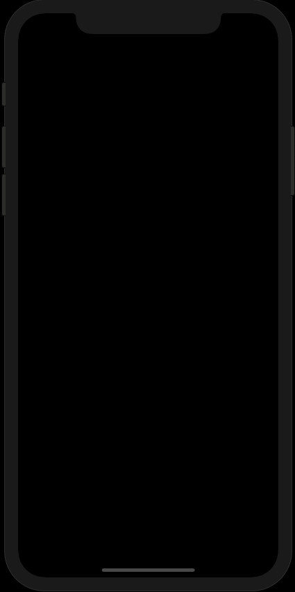

# Quiz

This is a simple iOS app where the user presses a button which animates the question to be displayed and another button to display the corresponding answer.

## Getting Started

This project was created to explore the Xcode workspace and to learn the basics of iOS app building such as **MVC** architectural pattern, **Auto Layout**, outlet and action connections, simple animations, and the features of the **Swift** language.

## App Walkthrough GIF

This GIF shows the app in action.



## Lessons Learned
1. The lefthand side of the Xcode workspace is known as the navigator area. The *navigator selector* with icons allows for selection of the following navigators: project, source control, symbol, find, issue, test, debug, breakpoint and report.
2. The middle area of the workspace is known as the editor area. The editor area is usually presented in two ways: the standard editor for working on a source file and the graphic-style editor called the *Interface Builder* for when the **Main.storyboard** is selected. The *Interface Builder* splits the area in two with the lefthand being the *document outline* and the righthand being the *canvas*.
3.  The righthand side of the workspace is known as the utility area and it has the inspector and the library. The *inspector selector* at the top has icons which allows for selection of the file inspector and the quick help inspector when a source file is in the editor area. If the **Main.storyboard** is selected, the *inspector selector* additionally allows for selection of the following inspectors: identity, attributes, size and connections. The library at the bottom has items, such as buttons, labels and sliders,  that can be dragged on to the *canvas* of the *Interface Builder*.
4. A key concept in the iOS app architecture is the **MVC** pattern, which stands for Model-View-Controller. This concept states that model layer, such as strings and numbers that the user manipulates, is independent of the view layer, such as labels, buttons and other visual UI elements, that the user interacts with. The controller layer sits right in between the model layer and the view layer to keep them synchronized by receiving messages and dispatching instructions.
5. **Auto Layout** ensures that the view objects are laid out correctly regardless of a device's screen orientation and/or resolution. It does so by specifying *constraints* for both the size and the position of individual view objects in the view heirarchy.
6. A *connection* allows for one object to know where another object is in memory so that the two objects may communicate. An *outlet* connection is a reference to an object while an *action* connection is a method to be triggered by an object such as a slider or a button.
7. To set up an outlet connection, Control-drag *from* the object with the outlet *to* the object that the outlet should point to. For an action connection, Control-drag *from* the object, such as a button, *to* it's target, such as a view controller. The target is usually a view controller and the method to be triggered is the *action*.
8. The **view** property of a **UIViewController** instance is automatically connected to the view object that represents the background in **Main.storyboard**.
9. Images for the app, such as *application icons*, are to be added to the **Assets.xcassets** file.
10. Compared to other languages, *structures* and *enumerations* in **Swift** are more powerful as they can be extended and can conform to protocols. The three basic groups of **Swift** types, *structures*, *enumerations* and *classes*, can all have the following: i) properties, ii) initializers, iii) instance methods and iv) class or static methods.
11. **Swift** has three collection types: *arrays*, *dictionaries*, and *sets*. While arrays and dictionaries have a shorthand syntax, sets do not. For example, an integer array variable can be declared in shorthand as **[Int]** instead of **Array\<Int\>**. Similarly, a string key and a string value dictionary can be declared in shorthand as **[String:String]** instead of **Dictionary<String, String>**. However, an integer set can only be declared as **Set\<Int\>**.
12. There are two ways of creating new instances of a specific type: i) by using literal values for a constant or variable declaration, such as `let x = 45`, ii) by using an intializer on the type, such as **String()** or **Int()**.
13. In **Swift**, member variables are called *properties* while in **Java** they are called *fields*.
14. In **Swift**,  types can be *optional* as indicated by the **?** after a type, e.g. **let name: String?**. This indicates that a variable may or may not have a value. There are two ways to unwrap an optional: use **!** to forcibly unwrap or use conditional **if let** for *optional binding*.
15. **Swift** allows *string interpolation* to allow for local variables inside a **print** statement using the `\ (  ... )` syntax.
16. **Swift** enumerations can have raw values. Also, switch statements for enum cases must be exhaustive and the switch cases do NOT fall through .
17. To animate view objects, use the static animation methods of the **UIView** class, the simplest of which is **animate(withDuration:animations:)**. There are other animations methods allowing for spring animations, executing completion closures and switching references of variables.
18. When animating constraints, calling the **layoutIfNeeded()** instance method on the main view is useful as any change in a constraint requires the system to recalculate the frames of all the related views.
19. Closures can be very similar to functions and methods. Closures can be the return type or an argument of a function. A closure signature has a comma separated list of arguments within a parenthesis followed by a return arrow and the return type: `() -> Void`. The declaration syntax consists of a parenthesis with arguments followed by a return arrow, then the return type and then the keyword **in** and finally the code to be executed, all enclosed in a pair of braces:
```
    { (arguments) -> Void in
        // code 
    }
```
